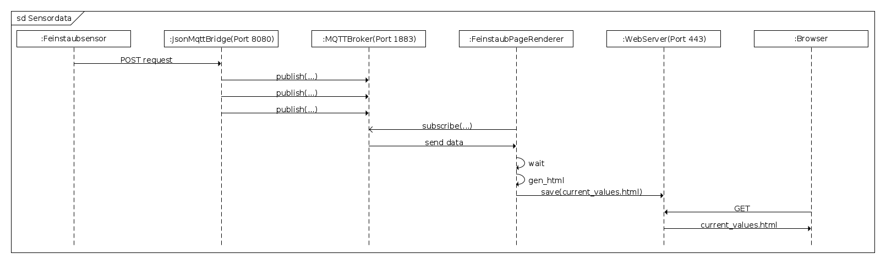

# luftdaten.tbs1.de
Webseite zur Darstellung von Sensordaten

# Überblick

# Installation

Der Dienst kann mit [ansible](https://docs.ansible.com) installiert werden

    $ ansible-playbook playbook-deploy.yml

Im Playbook wird ein Host ``luftsensor_deploy``verwendet, der in der 
entsprechenden Hosts-Datei als 
[Inventory](https://docs.ansible.com/ansible/intro_inventory.html) 
angegeben werden muss.
