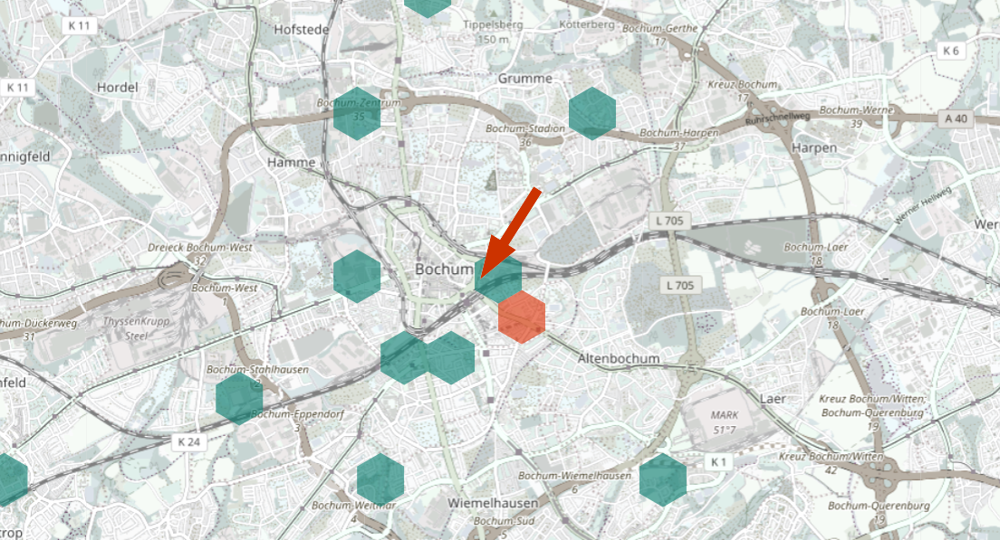
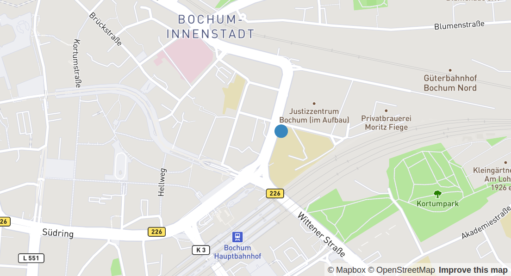

# Feinstaubwerte

MP10                  | MP 2.5
----------------------|-------
{p1} &micro;g/m&sup3; | {p2} &micro;g/m&sup3;

- MP10: (Maximal zulässiger Grenzwert im Jahresmittel: 40 &micro;g/m&sup3; )
- MP2.5: (Maximal zulässiger Grenzwert im Jahresmittel: 25 &micro;g/m&sup3;)

<!-- Grenzwerte gemäß http://www.umweltbundesamt.de/themen/luft/luftschadstoffe/feinstaub -->

# Wetter

Temperatur           | Relative Luftfeuchtigkeit
---------------------|--------------------------
{temperature} &deg;C | {humidity} %

# Letzte Aktualisierung

{update}

# Archiv-Daten und Diagramme

## Gleitender 24h-Durchschnitt

 

 

## &Uuml;ber einen Tag

 

 

## &Uuml;ber eine Woche

 

 

## &Uuml;ber einen Monat

 

 

# Archiv-Daten im CSV-Format

- [archive.luftdaten.info](https://archive.luftdaten.info)
- Feinstaub PM10 und PM2.5: ``/yyyy-mm-dd/yyyy-mm-dd_sds011_sensor_3659.csv``
- Temperatur und Luftfeuchtigkeit: ``/yyyy-mm-dd/yyyy-mm-dd_dht22_sensor_3660.csv``

Der Feinstaubsensor befindet sich an der E-Bike-Garage der
[Technischen Beruflichen Schule 1](https://www.tbs1.de) an der
Kreuzung Ostring/Moritz-Fiege-Stra&szlig;e in Bochum.

<address>
                  <strong>Geokoordinaten</strong> 
                  Breite: 51.4810  
                  L&auml;nge: 7.2249
</address>

[openData Feinstaub Map](http://bochum.maps.luftdaten.info/#13/51.4810/7.2248)

